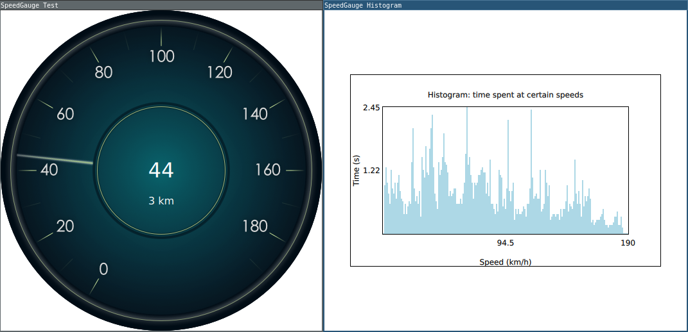

# Junior task for Siili_Auto 2022

*Beware thee who enterth and lieth thine eyes upon there w'rks.*

</img>

## Notes on each task

### 1 [QML]: The gauge graphics

TopCircle.png shading was cropped awkwardly, so removed it altogether.

### 2 [QML,C++]: Velocity Control

Done as QML_NAMED_ELEMENT(GaugeControl). In principle should be able to control any gauge.
The provided simulation-model would produce values larger than "max_speed" as the function limit really is not 1 but 3.25/3.0. Tried to work around it, but currently high-end speeds are scarcely generated.

### 3 [C++]: External sources

GaugeControl input defaults to stdin -> allows piping and streaming a text file. E.g. *"./speed_simulation | ./appSiili_Task"* or *"./appSiili_Task << speed_data.txt"*. Implemented simple switch -s or --simulated to use internally simulated data. As a consequence you can have simulation and input-reading running simultaneously, or set multiple inputs. Treating as a feature, not a bug: user is responsible.

### 4 [C++]: Run in GUI or terminal

Implemented simple switch -g or --graphical to start as QGuiApplication. Program defaults to QCoreApplication. 

### 5 [C++]: Allow developer to specify source of speed

Currently a developer may in principle set any QTextStream or a QTextStream supporting QIODevice as input.

### 6 [C++]: Collect statistics and store at the end of use

Statistics collected each time gauge-value changes. Value was initially stored in an array where the index corresponds to a specific speed, and stores the cumulative time spent in that speed. Converted to QList in order to expose to QML as an array.

Connected log file writing to SIGNAL(qApp::aboutToQuit). For a console application overrode SIGINT as Ctrl+C is the method to quit. Didn't implement file writing yet.

### 7 [QML,C++]: Display live statistics

Made a DIY histogram as I couldn't find examples, and as I was afraid BarSeries would not suffice (lacking the spacing option for example). Every speed is represented by it's own column, as specified in the task pdf.

## Progress log

# 14.6.

Sat down with pen and paper to think through how the program should flow. Created this repository. Implemented choice between graphical and text based use.

# 13.6.

Tried working step by step, got the initial work done but hit a wall overthinking how to properly do the command line switches.

The SpeedGauge QML-element and it's C++ counterpart were about ready at this point tho.
